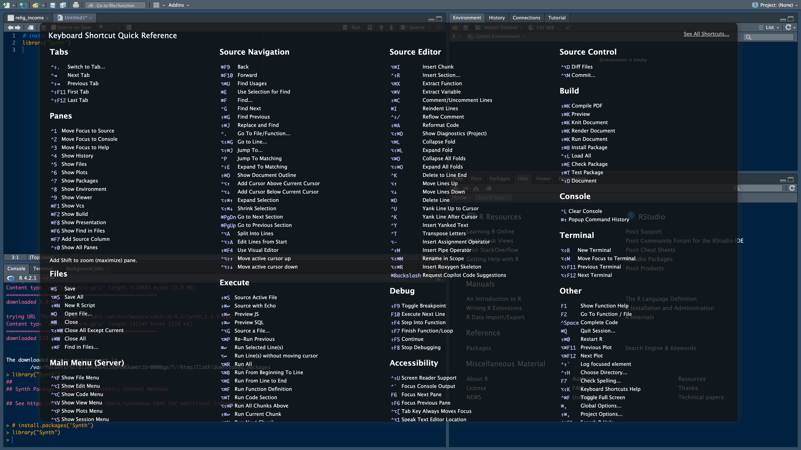

# R for Data Science

- [R for Data Science](#r-for-data-science)
  - [R Language Basics](#r-language-basics)
    - [Basic Grammar](#basic-grammar)
      - [operators](#operators)
        - [pipe operator](#pipe-operator)
      - [control structures](#control-structures)
    - [Common Data Structures in R](#common-data-structures-in-r)
      - [Date and Times](#date-and-times)
    - [R functions](#r-functions)
    - [Apply family](#apply-family)
    - [statistical functions](#statistical-functions)
    - [debugging tools](#debugging-tools)
    - [Scoping Rules in R](#scoping-rules-in-r)
      - [Lexical Scoping (Static Scoping)](#lexical-scoping-static-scoping)
      - [Dynamic Scoping](#dynamic-scoping)
    - [Files I/O](#files-io)
  - [Packages](#packages)
    - [Tidyverse](#tidyverse)
    - [MLR](#mlr)
  - [Data Cleaning in R](#data-cleaning-in-r)
  - [Learning Resources](#learning-resources)
    - [Download and Set-up](#download-and-set-up)
    - [R-Studio](#r-studio)
    - [Learning Resources](#learning-resources-1)

## R Language Basics

### Basic Grammar

#### [operators](https://r-coder.com/operators-r/#Assignment_operators_in_R)

- Arithmetic
  - \+ \- \* / ...
  - %% mod
  - %/% integer division
  - ^ exponential
- Relational
  - >, <, >=, !=, ...
- Assignment
  - <-
    - In many scripting programming languages you can just use the equal sign (=) to assign a variable. For R, the best practice is to use the arrow assignment (<-). Technically, the single arrow assignment can be used in the left or right direction. But the rightward assignment is not generally used in R code.
    - equal to "="
  - <<-
    - double arrow assignment, known as a scoping assignment. But the scoping assignment is for advanced R users
 - ->, ->>
- logical operators
  - AND (sometimes represented as & or && in R)
    - & for element-wise "AND"
  - OR (sometimes represented as || in R)
    - | for element-wise OR
  - NOT (!)

##### pipe operator

- pipe operator %>% is used to pass the result of one expression as the input to the next expression. 
- This operator is provided by the magrittr package and is widely used in the dplyr package for data manipulation.

```r
result <- data %>%
  filter(x > 2) %>%      # Filter rows where x is greater than 2
  mutate(z = x + y) %>%  # Create a new column z which is the sum of x and y
  select(x, z)           # Select only the x and z columns
```

#### control structures

- if-else
  - if{} else {}
- for
- while
- repeat
- break
- next

### Common Data Structures in R 

atomic classes:

- numeric
- logical
- character
- integer
- complex
- raw

R objects:

- vectors
  - one-dimensional array that can hold values of the same data type. It can be created using the c() function.
  - subsetting: no ":" (comparing to Python/Matlab)
- lists
  - different from atomic vectors because their elements can be of any type—like dates, data frames, vectors, matrices, and more. Lists can even contain other lists. 
  - subsetting $, [[]]
- data frames
  - a data frame is a collection of columns–similar to a spreadsheet or SQL table
  - data frames are commonly used for data analysis and manipulation
- matrix
  - is a multi-dimensional extension of a vector. It can store values of the same data type in multiple dimensions
- arrays
  - two-dimensional collection of elements arranged in rows and columns. All elements in a matrix must be of the same data type
- factors
  - categorical variable that represents discrete levels or categories. Factors are useful for representing data with a limited number of distinct values,
- missing values
- names

```r
# determine the prototype of a vector
typeof(c(“a” , “b”))
x <- c(33.5, 57.75, 120.05)
# length of a vector
length(x)
is.integer(x)
# structure of an object
# The str() function is particularly useful when working with complex objects like data frames or lists, as it provides a quick overview of the object's components.
str(list("a", 1L, 1.5, TRUE))

# create a matrix
matrix(c(3:8), nrow = 2)

```


#### Date and Times

> [lubricate.tidyverse](https://lubridate.tidyverse.org/index.html)
> [datetime w.lubricate cheatsheet](https://rawgit.com/rstudio/cheatsheets/master/lubridate.pdf)

```r
library(tidyverse)
library(lubridate)
# from function
today()

# create from string
ymd("2021-01-20")
mdy("January 20th, 2021")
ymd_hms("2021-01-20 20:11:59")
mdy_hm("01/20/2021 08:01")

# create from numbers
ymd(20210120)

# switch between datetime and a date
as_date(now())
```

### R functions

### Apply family

- lapply: Loop over a list and evaluate a function on each element
- sapply: Same as lapply but try to simplify the result· apply: Apply a function over the margins of an array· tapply: Apply a function over subsets of a vector
- mapply: Multivariate version of lapply

### statistical functions

Functions for probability distributions in R· rnorm: generate random Normal variates with a given mean and standard deviation

- dnorm: evaluate the Normal probability density (with a given mean/SD) at a point (or vector of points)
- pnorm: evaluate the cumulative distribution function for a Normal distribution · rpois: generate random Poisson variates with a given rate
- d for density· r for random number generation · p for cumulative distribution· q for quantile function

### debugging tools

- traceback: prints out the function call stack after an error occurs; does nothing if there’s no error
- debug: flags a function for “debug” mode which allows you to step through execution of a function one line at a time
- browser: suspends the execution of a function wherever it is called and puts the function in debug mode
- trace: allows you to insert debugging code into a function a specific places 
- recover: allows you to modify the error behavior so that you can browse the function call stack
- System.time and Rprof()

### Scoping Rules in R

#### Lexical Scoping (Static Scoping)

- Default in R 
- Function Environment:
  - When a function is defined, it creates an environment capturing the variables in the scope where the function was defined.
- Variable Lookup Order:
  - Local Environment (within the function itself)
  - Enclosing Environment (where the function was defined)
  - Global Environment (global workspace)
  - Base Package (base R environment)
  - Empty Environment (signals the end of the search)

```r
   make_counter <- function() {
     count <- 0
     function() {
       count <<- count + 1
       count
     }
   }

   counter <- make_counter()
   counter()  # Returns 1
   counter()  # Returns 2

```

#### Dynamic Scoping

- Not the Default:
  - Dynamic scoping is not the default in R but can be mimicked using constructs like eval and parent.frame
  - default in other languages such as Python
- Variable Lookup:
  - Looks for variable values in the calling functions' environments, moving up the call stack.

```r
f <- function() {
    x <- 10
    g()
}

g <- function() {
    print(eval(quote(x), parent.frame()))
}

x <- 20
f()  # Prints 10
```

### Files I/O

read

- read_csv(): comma-separated values (.csv) files
- read_tsv(): tab-separated values files
- read_delim(): general delimited files
- read_fwf(): fixed-width files
- read_table(): tabular files where columns are separated by white-space
- read_log(): web log files

write

- write.csv(): Writes data to a CSV file.
- write.table(): Writes data to a text file.
- writeLines(): Writes character strings to a text file.
- saveRDS(): Saves data as an RDS file.
- write.xlsx() or write_excel(): Writes data to an Excel file.

packages

- readr package: Provides functions like read_csv() and write_csv() for efficient reading and writing of delimited text files.
- haven package: Supports reading and writing data in SAS, SPSS, and Stata file formats using functions like read_sas(), read_spss(), read_dta(), etc.
- jsonlite package: Offers functions like fromJSON() and toJSON() for working with JSON data.

readr package

- read_csv(): comma-separated values (.csv) files
- read_tsv(): tab-separated values files
- read_delim(): general delimited files
- read_fwf(): fixed-width files
- read_table(): tabular files where columns are separated by white-space
- read_log(): web log files

readxl package

- read_excel()
- excel_sheets()

file manipulation

> [R documentation: Files](https://www.rdocumentation.org/packages/base/versions/3.6.2/topics/files)

- dir.create
  - create "destination_folder"
  - dir.create function to create a new folder, or directory, to hold your files.
- file.create()
  - create files like .txt, .docx, or .csv.  
- file.copy (a , b)
- delete: unlink (“some_.file.csv”)

[how to name files](https://speakerdeck.com/jennybc/how-to-name-files?slide=18)

- Files should be named consistently
- File names should be short but descriptive (<25 characters) (Briney, 2015)
- Avoid special characters or spaces in a file name
- Use capitals and underscores instead of periods or spaces or slashes
- Use date format ISO 8601: YYYYMMDD
- Include a version number (Creamer et al. 2014)
- Write down naming convention in data management plan

## Packages

### Tidyverse


- **What is Tidyverse?**
  - A collection of R packages designed for data science.
  - Provides tools for data manipulation, exploration, and visualization.
  - Emphasizes a consistent and coherent approach to data analysis.
- **Core Packages in Tidyverse:**
  - **ggplot2**: For data visualization.
  - **dplyr**: For data manipulation.
  - **tidyr**: For data tidying.
  - **readr**: For reading rectangular data (like CSV files).
  - **purrr**: For functional programming.
  - **tibble**: For modern data frames.
  - **stringr**: For string manipulation.
  - **forcats**: For working with categorical data (factors).


> [The tidyverse cookbook](https://rstudio-education.github.io/tidyverse-cookbook/how-to-use-this-book.html)

tidy data, a data structure in which

- Each row represents a single observation.
- Each column represents a variable
- Organize and display your data in a sensible way (tibble)
- Manipulate and subset your data (dplyr)
- Plot your data (ggplot2)
- Replace for loops with a functional programming approach (purrr)

[tibbles](https://tibble.tidyverse.org/)

- what is tibbles
  - Tibbles are like streamlined data frames that are automatically set to pull up only the first 10 rows of a dataset, and only as many columns as can fit on the screen. This is really useful when you’re working with large sets of data.
  - Unlike data frames, tibbles never change the names of your variables, or the data types of your inputs.
  - Overall, you can make more changes to data frames, but tibbles are easier to use.

### MLR

## Data Cleaning in R

- data() : list all data sets available in R
- data.frame(): create a dataframe
- as_tibble(x)
- view data
  - head(), str(), colnames()
  - skim_without_charts()
  - glimpse()
- select data
  - select()
- modify data
  - rename(col1 = col2), renmame_with(), clean_names()
  - arrange(x, col)
  - separate(x, col, into=c(), sep = "")
  - unite()
  - mutate(x, func): mutate in place
    - part of dplyr package
- grouping
  - group_by(col)
  - wide to long: [pivoting in tidyverse](https://tidyr.tidyverse.org/articles/pivot.html)
- aggregators
  - summarize(/<expression/>)
  - sd(), min(), max(), summarize()
  - filter()
- missing value
  - drop_na()
- relationship between data
  - cor(),  
  - [bias()](https://www.rdocumentation.org/packages/SimDesign/versions/2.2/topics/bias) : part of the SimDesign Package

## Learning Resources

### Download and Set-up

- download R at [CRAN](https://cran.r-project.org/mirrors.html)
- cloud access to [R studio](https://posit.cloud/content/8376590)
- Download [R Studio Desktop](https://posit.co/download/rstudio-desktop/)

Download packages

Packages can be found in repositories, which are collections of useful packages that are ready to install. You can find repositories on Bioconductor, R-Forge, rOpenSci, or GitHub, but the most commonly used repository is the Comprehensive R Archive Network or [CRAN](https://cran.r-project.org/)


```r
install.packages("tidyverse")
install.packages("mlr", dependencies = TRUE)
# for file referencing
install.packages("here")
# for data cleaning
install.packages("skimr")
install.packages("janitor")
# calculate bias
install.packages("SimDesign")
```

More: quicklist of [useful R-pacakges](https://support.posit.co/hc/en-us/articles/201057987-Quick-list-of-useful-R-packages)

### R-Studio

[R studio keyboard Shortcuts ](file:///Applications/RStudio.app/Contents/Resources/app/www/docs/keyboard.htm)




### Learning Resources 

Books

- [R for Data Science](https://r4ds.had.co.nz/index.html) (R4DS)
- [The tidyverse cookbook](https://rstudio-education.github.io/tidyverse-cookbook/how-to-use-this-book.html)
- [RyouWithME](https://rladiessydney.org/courses/ryouwithme/)


websties

- [R Studio](https://www.rstudio.com/)
- [R Studio Cheatsheets](https://www.rstudio.com/resources/cheatsheets/)
- [R Studio Primer](https://rstudio.cloud/learn/primers/3)
- [R coding style](https://d3c33hcgiwev3.cloudfront.net/O4EaLwvJSyWBGi8LycsltA_1bd17f3110814c78a739c3d3c0f4use1_Keeping-your-code-readable.pdf?Expires=1703980800&Signature=UUrgAKezfQHeUZZUMzDptIotLJ0Q-gNk8clrwpuqvNPecdwoSqlml-k8ciVqws0HLR8fvWkUL2fwmyidJfknA0YPvHKHOzxjoVv2~KEpIT-27qQ2rLIwnOjS6IloPr2VjCwB4UN2vX2sL~Df~IOo2r2BoeANUQ4o-L-p-5uqeXI_&Key-Pair-Id=APKAJLTNE6QMUY6HBC5A)

resoures

- [RStudio Community](https://community.rstudio.com/)
- [r/RLanguage](https://www.reddit.com/r/Rlanguage/) (reddit)
- [rOpenSci](https://discuss.ropensci.org/)
- [R4DS Online Learning Community and Slack](https://www.rfordatasci.com/) 
- [Twitter #rstats](https://twitter.com/hashtag/rstats?lang=en): If you use Twitter, you can connect with other R users using the hashtag #rstats; a lot of R developers and analysts are active on Twitter. 

communities

- [Meet-ups](https://www.meetup.com/topics/data-analytics/)
- [R user groups](https://jumpingrivers.github.io/meetingsR/r-user-groups.html)

must-have packages


R vs Python Comparison 


| Feature            | R                                                                                  | Python                                                                                          |
|--------------------|-------------------------------------------------------------------------------------|-------------------------------------------------------------------------------------------------|
| Common Features    | - Open-source                                                                       | - Open-source                                                                                   |
|                    | - Data stored in data frames                                                        | - Data stored in data frames                                                                    |
|                    | - Formulas and functions readily available                                          | - Formulas and functions readily available                                                      |
|                    | - Community for code development and support                                        | - Community for code development and support                                                    |
| Unique Advantages  | - Data manipulation, data visualization, and statistics packages                    | - Easy syntax for machine learning needs                                                        |
|                    | - "Scalpel" approach to data: find packages to do what you want with the data       | - Integrates with cloud platforms like Google Cloud, Amazon Web Services, and Azure             |
| Unique Challenges  | - Inconsistent naming conventions make it harder for beginners to select functions  | - Many more decisions for beginners to make about data input/output, structure, variables, etc. |
|                    | - Methods for handling variables may be a little complex for beginners to understand| - "Swiss army knife" approach to data: figure out a way to do what you want with the data       |